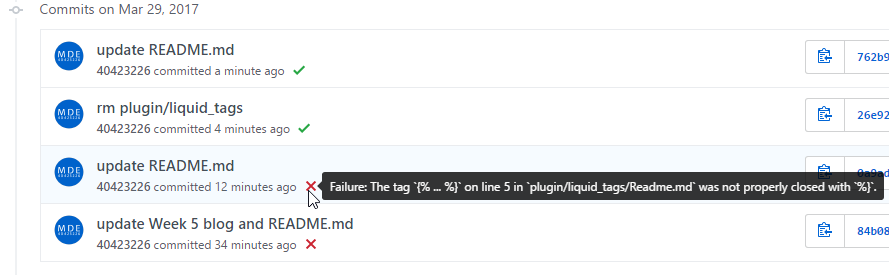

Title: 201703029 Week 6
Date: 2017-03-29 11:00
Category: Course
Tags: SolveSpace, V-rep
Slug: Week 6
Author: 40423226

<h3>Fourbar 安裝 base</h3>
<iframe src="https://player.vimeo.com/video/210037555" width="640" height="332" frameborder="0" webkitallowfullscreen mozallowfullscreen allowfullscreen></iframe>

<a href="https://vimeo.com/210037555">Fourbar (base) (SolveSpace)</a> from <a href="https://vimeo.com/mde40423226">NFU-MDE-104B-40423226</a> on <a href="https://vimeo.com">Vimeo</a>.

<h3>Fourbar 運動模擬</h3>

在 V-rep 模擬

<iframe src="https://player.vimeo.com/video/210018813" width="640" height="347" frameborder="0" webkitallowfullscreen mozallowfullscreen allowfullscreen></iframe>

<a href="https://vimeo.com/210018813">Fourbar (V-rep)</a> from <a href="https://vimeo.com/mde40423226">NFU-MDE-104B-40423226</a> on <a href="https://vimeo.com">Vimeo</a>.

<h3>解決倉儲推送出現問題</h3>

雖然我們網頁的設置沒有進行更改, 但 GitHub 仍不斷地更新, 換句話說短短時間我們又退步

GitHub 這次也很貼心地又寄信給我

解決的辦法, 一樣刪除 plugin 下的 liquid_tags 目錄

<a href="https://github.com/40423226/2017springcd_hw/commit/26e92c47839f7c720d855bfdaa5fff279ca533e1">查看刪除的內容</a>
